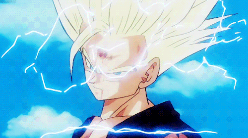

<p align="center">
	
</p>

> ⚠️ Gohan is currently in pre-alpha. **Use at your own risk.**

# Gohan

An alternative Handshake wallet node and CLI that focuses on the following things:

1. Fast performance.
2. Low resource usage.
3. Unified APIs.
4. Easy embeddability.


To learn more about how Gohan works and how to use it, head on over to the documentation site at [www.gohanhns.com](https://www.gohanhns.com) or read on here.

# Installation

Gohan consists of a single binary that contains both the wallet node and the CLI. To install Gohan, download the appropriate release tarball for your OS/architecture then extract it somewhere on your `$PATH`.

An example of how to do this on Linux systems is below:

```shell
# Assuming you're downloading version 0.0.1:
curl -L https://github.com/kurumiimari/gohan/releases/download/0.0.1/gohan-v0.0.1.linux-amd64.tar.gz > gohan-v0.0.1.linux-amd64.tar.gz
tar -C /usr/local/bin gohan-0.0.1.linux-amd64.tar.gz
```

You can find the list of available releases on the [releases](https://github.com/kurumiimari/gohan/releases) page.

Releases can be verified using GPG. Here's how to do that on linux:

```shell
# Assuming you already download the tarball using the curl command above
curl -L https://github.com/kurumiimari/gohan/releases/download/0.0.1/gohan-v0.0.1.linux-amd64.tar.gz.asc > gohan-v0.0.1.linux-amd64.tar.gz.asc
gpg --verify gohan-v0.0.1.linux-amd64.tar.gz.asc
```

If everything checks out, you should see output like this in your terminal:

```
gpg: assuming signed data in 'gohan-v0.0.1.linux-amd64.tar.gz'
gpg: Signature made Sat Jun 12 02:07:43 2021 UTC
gpg:                using RSA key 2CD96539D07E7FD1431CDC0E684A02A9B8724012
gpg: Can't check signature: No public key
gpg: Signature made Sat Jun 12 02:07:43 2021 UTC
gpg:                using RSA key 2CD96539D07E7FD1431CDC0E684A02A9B8724012
gpg: Good signature from "Kurumi Imari <kurumiimari@protonmail.com>" [unknown]
gpg: WARNING: This key is not certified with a trusted signature!
gpg:          There is no indication that the signature belongs to the owner.
Primary key fingerprint: 2CD9 6539 D07E 7FD1 431C  DC0E 684A 02A9 B872 4012
```

# Usage

Gohan talks to a Handshake full node in order to download block data. If you use `hsd`, start it with the following command:

```shell
hsd --no-wallet
```

No special indexing options are required, though you are welcome to specify them for your own purposes. They won't interfere with Gohan's operation.

Next, start the Gohan wallet node with `gohan start`. You should see log messages appearing in your terminal.

You can now use the Gohan CLI. Run `gohan --help` to view a list of commands. You'll see output that looks something like this:

```
A Handshake wallet node

Usage:
  gohan [command]

Available Commands:
  accounts               Lists a wallet's accounts
  bid                    Sends a bid
  create                 Creates a wallet
  finalize               Finalizes a transferring name
  help                   Help about any command
  import                 Imports a wallet
  info                   Gets information about an account
  name-history           Lists history for a name belonging to an account
  names                  Lists names for an account
  open                   Opens a name for bidding
  redeem                 Sends a redeem
  rescan                 Rescans from the provided height. Default to zero
  reveal                 Sends a reveal
  send                   Sends funds
  sign-message           Signs a message with the address's private key
  sign-message-with-name Signs a message with a name's address
  start                  Starts the gohan daemon
  status                 Returns status information about the wallet node
  transactions           Lists transactions for an account
  transfer               Transfers a name
  unlock                 Unlocks a wallet
  lock                   Locks a wallet
  unspent-bids           Returns all bids that haven't been revealed yet
  unspent-reveals        Returns all reveals that haven't been redeemed yet
  update                 Sends an update
  wallets                Lists all wallets
  zap                    Zaps pending transactions

Flags:
  -a, --account-id string   Sets the account ID (default "default")
      --api-key string      Sets the wallet's API key.
  -h, --help                help for gohan
  -n, --network string      Set's gohan's network (default "main")
      --prefix string       Sets gohan's data directory (default "~/.gohan")
  -u, --server-url string   Sets a custom node RPC server url
  -w, --wallet-id string    Sets the wallet ID (default "primary")

Use "gohan [command] --help" for more information about a command.
```

If this is your first time using Gohan, you'll probably want to either create a new wallet or import one. To do this, either run `gohan create` or `gohan import` and the CLI will walk you through the rest.

To point Gohan at a different network, use the `-n`/`--network` flag. To point Gohan at a hosted node service, use the `-n` _and_ the `--server-url` flags together. Make sure to specify a port for the URL if it's not running on 80 or 443.

For a full description of all these commands and their underyling REST endpoints, check out the [documentation](https://www.gohanhns.com). 

# Security

If you encounter a security issue, please don't open an issue on GitHub. Instead, e-mail me directly at `kurumiimari@protonmail.com`. My GPG key fingerprint is `2CD9 6539 D07E 7FD1 431C  DC0E 684A 02A9 B872 4012`; this is also the key I use to sign the Gohan binaries. You can also use my default key on Protonmail.

# MORE POWER

